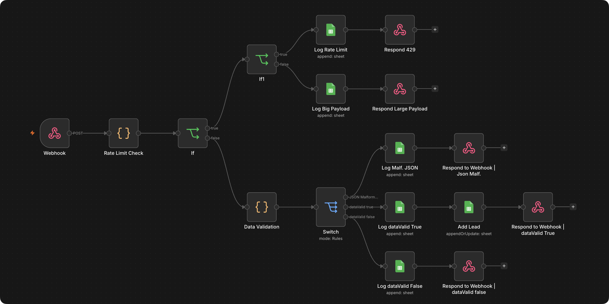

<h1>Secure Lead-Intake Webhook</h1>

A hardened webhook endpoint: rate limited, size limited, and validated before anything touches storage.

<h3>What it does</h3>

→ Rejects requests over the rate limit (7 per IP per minute) with a 429 
→ Rejects oversized payloads (over 1MB) with a 413 
→ Validates and sanitizes the body, strips HTML tags and quote characters, before accepting it. Malformed or incomplete data gets a 400 with the specific reason 
→ Logs every outcome, accepted or rejected, before responding

<h3>Why it's here</h3>

Practice piece for input security: rate limiting, payload limits, and sanitization on a public-facing webhook, before any business logic runs. Kept out of the portfolio since it's a security pattern, not a business case study.

<h3>How it runs</h3>

Request hits the webhook → checked against the rate limit and payload size first → if it passes, the body gets validated and sanitized → valid leads get logged and stored, invalid ones get logged and rejected with the reason. Every path responds with a specific status code (200 / 400 / 413 / 429).

<h3>Stack</h3>

- Webhook (header-auth, rate limit + size check in Code nodes) 
- Google Sheets (request log + lead storage)

<h3>Setup</h3>

A Google Sheet with a Logs tab (IP, timestamp, payload size, auth, error) and a Leads tab (Name, Email, Message), a header-auth credential for the webhook.

<pre>
X_API_KEY=your-webhook-key
</pre>
