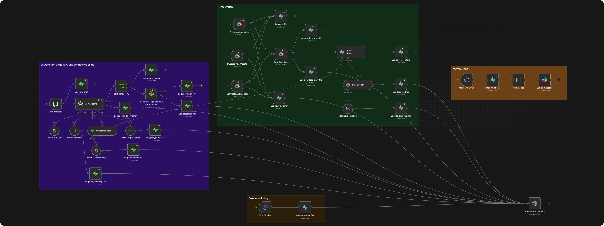

<h1>AI Business Assistant for Professional Services</h1>

Answers client questions from your actual documents, cites its sources, and hands off to you when it isn't sure.

<h3>What it does</h3>

→ Reads new documents dropped into Google Drive (contracts, policies, invoices) and adds them to a searchable knowledge base automatically 
→ Answers questions by searching your actual documents, not general knowledge, and cites the source 
→ Escalates to you in Slack instead of guessing whenever its confidence score drops below 76

<h3>Who it's for</h3>

Any professional services business, legal, consulting, accounting, where the same document-based questions come up over and over.

<h3>The problem</h3>

Every question a client asks means digging through contracts, policies, and invoices to find the actual answer, and "I'll check and get back to you" costs time you don't have.

<h3>How it runs</h3>

New document → chunked and embedded into Supabase → question comes in → AI searches the knowledge base → confidence above 76 answers directly with a citation, below that escalates to Slack for a human answer → every interaction logged.

<h3>Stack</h3>

- Google Drive (document source) 
- OpenAI (embeddings + chat model) 
- Supabase pgvector (knowledge base + audit trail) 
- Slack (escalation)

<h3>Setup</h3>

Google Drive folders for contracts, policies, and invoices, an OpenAI API key, a Supabase project with pgvector enabled plus a `documents` table and an `audit-trail` table, Slack OAuth credential with a channel for escalations and error alerts.

<pre>
CONFIDENCE_THRESHOLD=76
</pre>
