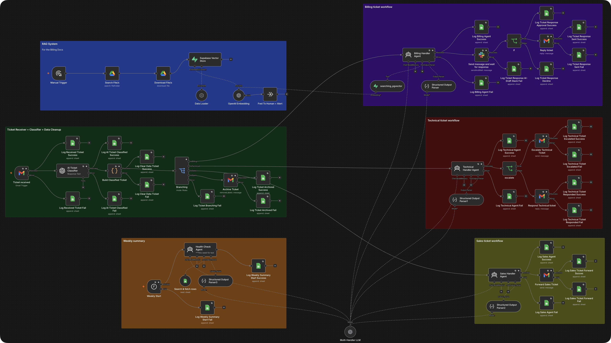

<h1>AI Customer Support Triage</h1>

Reads every support email, classifies it, and only replies when it's confident. Anything it isn't sure about goes to a human instead.

<h3>What it does</h3>

→ Classifies every incoming ticket as billing, technical, sales, or spam 
→ Drafts billing replies from your FAQ docs via RAG, but waits for your approval in Slack before sending 
→ Diagnoses technical tickets and escalates anything it isn't confident about instead of guessing

<h3>Who it's for</h3>

Small businesses where one inbox handles billing questions, technical issues, and sales leads all at once, and sorting them by hand is the first hour of every day.

<h3>The problem</h3>

Support emails don't come pre-sorted. A billing question, a technical complaint, and a sales lead all land in the same inbox, and you're the one deciding which is which before you can even start answering.

<h3>How it runs</h3>

Email arrives → AI classifies → routes to billing / technical / sales / spam → billing drafts wait for Slack approval before sending, technical escalates below a confidence threshold, sales forwards with a summary, spam archives.

<h3>Stack</h3>

- Gmail (ticket intake + reply) 
- OpenAI (classification + response agents) 
- Supabase pgvector (RAG over FAQ docs) 
- Google Drive (FAQ document source) 
- Slack (approval gate + escalation)

<h3>Setup</h3>

Gmail OAuth credential, OpenAI API key, a Supabase project with pgvector enabled and a `documents` table for the knowledge base, a Google Drive folder containing your FAQ docs, Slack OAuth credential with a channel for approvals and escalations.

<pre>
CONFIDENCE_THRESHOLD=76
</pre>
