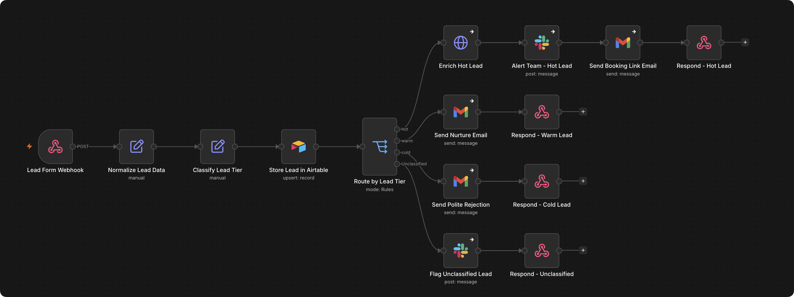

<h1>Freelancer Lead Intake System</h1>

Reads every form lead the moment it arrives, qualifies it by budget, and responds automatically. Hot leads get a booking link in seconds.

<h3>What it does</h3>

→ Normalizes and logs every lead the moment it hits the webhook 
→ Classifies each lead hot, warm, or cold by budget 
→ Enriches hot leads, alerts the team in Slack, and auto-replies with a booking link. Warm leads get a nurture email, cold leads get a polite decline

<h3>Who it's for</h3>

Freelancers and small service businesses whose leads come in through a form and get triaged by hand right now.

<h3>The problem</h3>

Every lead from a contact form lands the same way, an email you have to open, read, and decide what to do with. By the time you get to it, the good one already emailed two other freelancers.

<h3>How it runs</h3>

Form submission → webhook → normalize → classify by budget → log to Airtable → route hot / warm / cold → notify and respond.

<h3>Stack</h3>

- Webhook (form intake) 
- Airtable (lead log) 
- Slack (hot lead alerts) 
- Gmail (auto-reply, nurture, rejection) 
- HTTP Request (lead enrichment, bring your own provider)

<h3>Setup</h3>

Airtable base with a Leads table (Name, Email, Budget, Message, Tier, Status columns), Slack OAuth credential plus a channel for alerts, Gmail OAuth credential, and optionally an enrichment API key if you want the Enrich Hot Lead step live.

<pre>
LEAD_ENRICHMENT_API_URL=your-provider-endpoint
</pre>
