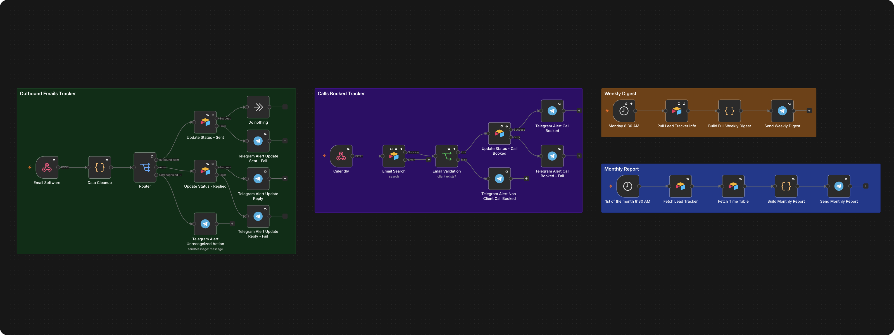

<h1>FreelancerOS</h1>

Updates my own outreach pipeline automatically and tells me every Monday exactly which leads are going cold.

<h3>What it does</h3>

→ Updates lead status in Airtable automatically every time an email goes out, someone replies, or a call gets booked 
→ Every Monday, sends a Telegram digest: pipeline by stage, conversion rates, and which leads need attention and why 
→ On the 1st of the month, calculates real revenue, hours worked, and effective hourly rate

<h3>Who it's for</h3>

Built for my own freelance pipeline. Works the same way for any solo operator or small team running outbound who's currently tracking leads in a spreadsheet that's always a week behind.

<h3>The problem</h3>

Every freelancer sends outreach, but pipeline tracking usually lives in your head or a spreadsheet that's a week out of date. By the time you notice a hot reply went cold or a proposal's been sitting untouched, the lead's already gone quiet.

<h3>How it runs</h3>

Email sent, reply, or call booked → webhook → status updates in Airtable → Telegram alert. Monday → digest of pipeline and priorities. 1st of the month → revenue, hours, and effective rate report. Any failure stops the workflow and alerts through a dedicated error handler instead of failing silently.

<h3>Stack</h3>

- Webhooks (email tool + Calendly) 
- Airtable (lead tracker + time table) 
- Telegram (alerts, digests, reports)

<h3>Setup</h3>

Airtable base with a Leads Tracker table (email, status, dates, revenue, lead_source columns) and a Time Table (date, hours), a Telegram bot credential, webhook endpoints pointed at from your email tool and Calendly with a shared API key header.

<pre>
X_API_KEY=your-shared-webhook-key
</pre>
