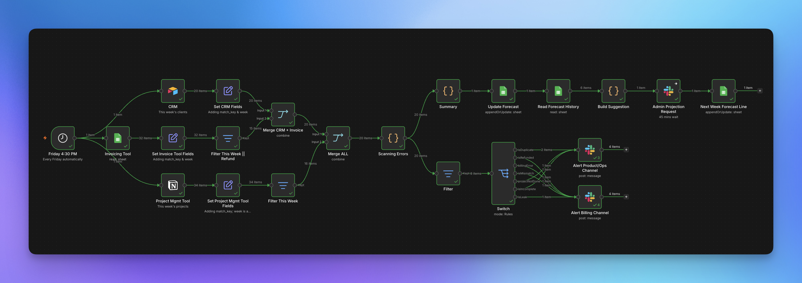

# Weekly Billing Reconciliation

**What it does**

Every Friday, this pulls the week's closed deals from a CRM   
→ cross-checks them against the invoicing tool 
→ cross-checks them again against the project tracker 

Three systems that normally never talk to each other, reconciled automatically.

It catches what hides in the gaps: a deal closed with no invoice 
→ an invoice sent for work that was never delivered 
→ a client billed while their deal still shows "Open" 
→ numbers that don't match between systems 
→ duplicate records 
→ refunds that slipped through.

Flagged issues route straight to Slack: billing problems to one channel, delivery/data problems to another. A revenue summary writes itself into a forecast sheet, and next week's projection gets suggested automatically from the trend, with a human still deciding the final number before it's added.

**Who it's for**

Any small consultancy running its CRM, invoicing, and project tracking in separate tools that don't sync and closing out the week by hand right now.

**Stack:** Airtable (CRM) · Google Sheets (Invoicing, Forecast ! just for placeholder) · Notion (Project Tracker) · Slack (alerts + human approval)

**Setup note:** `weekly-billing-reconciliation.json` has placeholder IDs (`YOUR_..._ID`) wherever it points at a real Airtable base, Google Sheet, Notion database, Slack channel, or Slack user. Swap those for your own before importing. Credentials aren't included, obviously.
