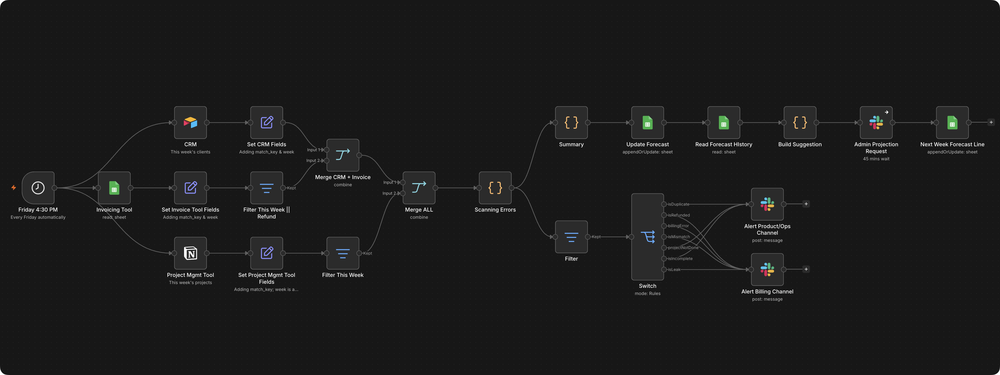

<h1>Weekly Billing Reconciliation</h1>

Cross-checks your CRM, invoicing, and project tracker every Friday, and flags what doesn't add up before you do.

<h3>What it does</h3>

→ Pulls this week's records from the CRM, invoicing sheet, and project tracker every Friday afternoon 
→ Matches records by client and scans for 7 specific billing problems 
→ Routes flagged issues to the right Slack channel, and suggests next week's revenue forecast for a human to approve

<h3>Who it's for</h3>

Any small consultancy running its CRM, invoicing, and project tracking in separate tools that don't sync, and closing out the week by hand right now.

<h3>The problem</h3>

Your CRM says a deal closed. Your invoicing tool says you billed for it. Your project tracker says the work is done. Three separate stories that are supposed to match, and every Friday somebody has to check them against each other by hand, or they don't get checked at all.

<h3>How it runs</h3>

Friday 4:30pm → pull CRM + Invoicing + Project Tracker → match by client → scan for exceptions → route flagged issues to Slack → log revenue → suggest next week's forecast for approval.

<h3>Stack</h3>

- Airtable (CRM) 
- Google Sheets (Invoicing, Forecast) 
- Notion (Project Tracker) 
- Slack (alerts + forecast approval)

<h3>Setup</h3>

Airtable CRM base, Google Sheets for invoicing and forecast tracking, a Notion project tracker database, Slack OAuth credential with channels for billing and product/ops alerts.

<pre>
FORECAST_APPROVAL_TIMEOUT_MINUTES=45
</pre>
